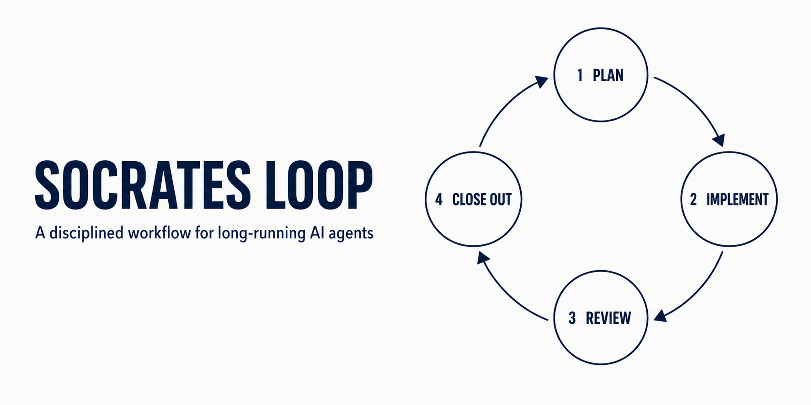

# Socrates Loop

Socrates Loop is a small set of Markdown templates for bootstrapping repository-specific instructions and a four-phase AI-assisted development workflow. It separates durable repository guidance from task plans, working memory, and diagnostic artifacts.

## How it works

Socrates Loop turns a long-running agent task into a sequence of inspectable, verifiable stages:

**Specification → Plan → Milestones → Implementation → Retrospective → Updated context → Next task**

1. **Plan:** The agent studies the repository without editing tracked files, then writes a task brief with milestones, success criteria, risks, and verification commands. Work pauses for approval.
2. **Implement:** The agent executes the approved plan in small change sets, verifies each set, and records investigation evidence outside the permanent repository guidance.
3. **Review and debug:** The user reviews the result. The agent handles failures with a reproduce, hypothesize, test, and surgical-fix loop.
4. **Close out:** The agent records decisions and verification evidence, promotes durable lessons into repository documentation, and archives a sanitized retrospective for future tasks.

## Why it works

- **Durable guidance stays concise.** Stable repository knowledge lives in `AGENTS.md`; task-specific details do not accumulate there.
- **Intent is inspectable before implementation.** Milestones, success criteria, invariants, and verification commands make drift visible while it is still inexpensive to correct.
- **Working evidence has a defined home.** Reproduction commands, hypotheses, failed experiments, and bug-impact records live in memory rather than being lost in chat history.
- **Human approval remains part of the loop.** The workflow creates explicit checkpoints before implementation and before closeout.
- **Useful history survives without loading everything.** Relevant closeouts can be selectively reloaded, while reusable lessons are promoted into the small set of documents future work should read first.

This is a human-guided engineering workflow, not an autonomous orchestration system. Its purpose is to help an agent work for longer without losing the goal, repeating mistakes, or silently changing important assumptions.

## Repository contents

| File | Purpose |
| --- | --- |
| [`AGENTS_TEMPLATE.md`](AGENTS_TEMPLATE.md) | Customizable repository guidance and the four-phase working agreement. |
| [`Agent-Zero-prompt.md`](Agent-Zero-prompt.md) | Bootstrap prompts for existing repositories and new repositories that begin with a design specification. |
| [`TASK_BRIEF_TEMPLATE.md`](TASK_BRIEF_TEMPLATE.md) | Task scope, status, milestones, success criteria, implementation plan, and decisions. |
| [`MEMORY_TEMPLATE.md`](MEMORY_TEMPLATE.md) | Compact investigation evidence, gotchas, bug-impact records, and verification results. |
| [`docs/assets/social-preview.png`](docs/assets/social-preview.png) | Source image for the repository’s GitHub social preview. |
| [`LICENSE`](LICENSE) | MIT license terms. |

## Setup

```bash
git clone https://github.com/jlong29/socrates-loop.git
cd socrates-loop

target_repo=/path/to/your/repo
mkdir -p "$target_repo/docs/agent"

cp AGENTS_TEMPLATE.md "$target_repo/AGENTS_TEMPLATE.md"
cp TASK_BRIEF_TEMPLATE.md MEMORY_TEMPLATE.md "$target_repo/docs/agent/"

cd "$target_repo"
mkdir -p .agent/logs
touch .gitignore
grep -qxF '.agent/' .gitignore || echo '.agent/' >> .gitignore
```

---

## Getting Started

Open the target repository in your coding agent, then copy the appropriate prompt from [`Agent-Zero-prompt.md`](Agent-Zero-prompt.md): use “Existing Repo” for an established codebase or “New Repo with design specification” when starting from a design document.

Feedback and contributions are welcome. [Open an issue](https://github.com/jlong29/socrates-loop/issues/new) to report a problem or suggest an improvement, or [submit a pull request](https://github.com/jlong29/socrates-loop/pulls) with a proposed change.

---

## License

This project is available under the [MIT License](LICENSE).
